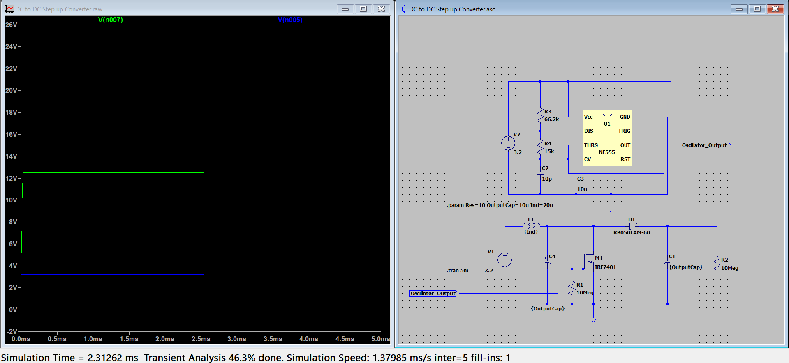
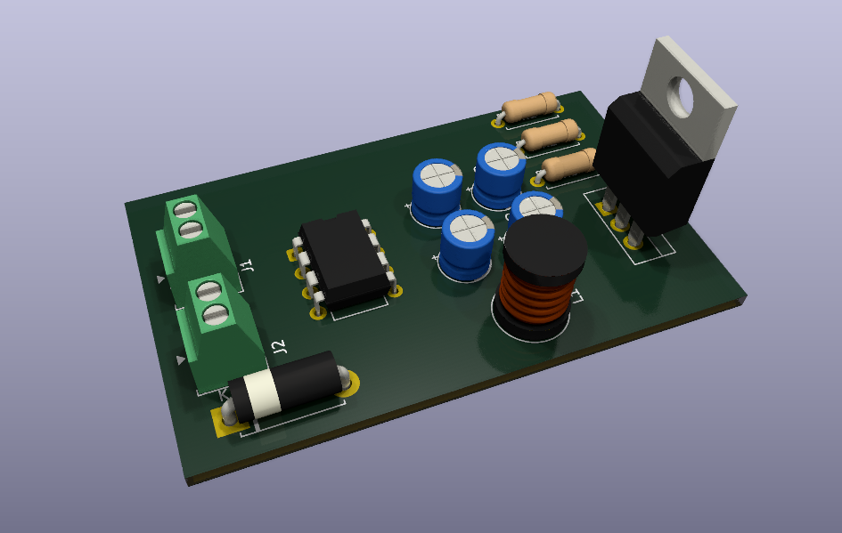
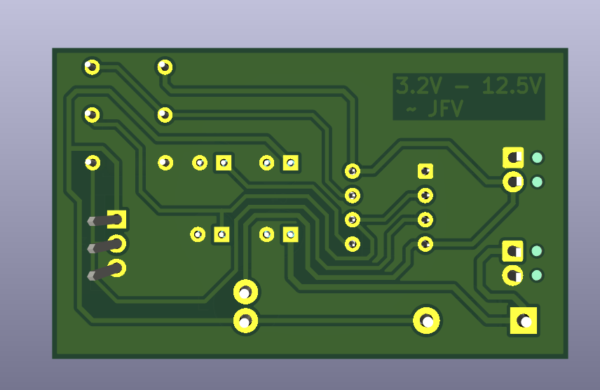

# DC-DC Step-Up Converter (3.2V to 12.5V)

A compact DC-DC boost converter that steps up input voltages from 3.2V to 12.5V. This project uses **LTspice** for simulation and **KiCad** for schematic capture and PCB layout.

---
## LTspice Simulation

The circuit was simulated in LTspice to verify voltage conversion, efficiency, and component stress before committing to a PCB. The design included an oscillator operating at roughly 1MHz at 84.41% Duty Cycle, a boost topology using an inductor, diode, switching MOSFET, and bypass capacitors.

---

## KiCad Schematic

The simulated circuit from LTspice was reflected in KiCad for PCB design preparation.

---

## KiCad PCB

This is the PCB layout created in KiCad. It is designed for compactness and ease of soldering, suitable for prototyping or integration into a larger system.

---

## 3D View

| Front View | Back View |
|------------|-----------|
|  |  |

A 3D visualization of the designed PCB, generated in KiCad. Useful for verifying component placement, orientation, and enclosure fit.

---

## Files Included

- `DC to DC Step up Converter.asc`: LTspice simulation file.
- `DC to DC stepup.kicad_pro`: KiCad project file for schematic and PCB.
- Images for schematic, layout, simulation, and 3D views.

